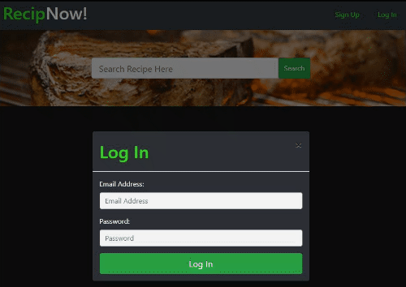

## RecipNow! - Project 2

- [Description](#Description)
- [Installations](#Installations)
- [Licence](#Licence)
- [Run the app](#test)
- [Contributing](#Contributing)
- [Credits](#Credits)
- [Questions](#Questions)
- [Screenshots](#Screenshots)

## Description
RecipNow! is a recipe sharing app that allows users to 
* view recipes that other user post
* create accounts on the app.
* login to use the accessible features provided
* change their passwords for login credentials (Future Development)
* create and post recipes
* edit recipes they have posted
* delete recipes they have posted
* comment on recipes posted (Future Development)
* get email notfications when another user comments on their post (Future Development)
* show reaction to a posted recipe by upvoting or downvoting (Future Development)

## Installations

* npm i bcryptjs
* npm i express
* npm i express-handlebars
* npm i express-session
* npm i handlebars
* npm i mysql2"
* npm i passport
* npm i passport-local
* npm i sequelize
* npm i chai
* npm i chai-http
* npm i cross-env
* npm i eslint
* npm i eslint-config-prettier
* npm i eslint-plugin-prettier
* npm i mocha
* npm i prettier

## Contributing
A work in progress. And the possibilities are endless.   Please feel free to submit any code updates for review and acceptance.
* ['RecipNow! - Github Repo'](https://github.com/zehrl/project-2-pod-2)

## Licence

## Test
Live Demo 
https://rocky-peak-18836.herokuapp.com/

## Credits
Hat tip to 
* Valentina Decyatnik
* Mathew Albete 
* Cory Keelan
* Logan Zehr
* Orlando Baello
* UW, Trilogy instructor, TAs and staffs.

## Questions
please feel free to ask any questions.
## Screenshots

